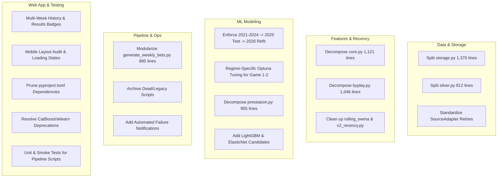

# 2026 Codebase Modernization & Full-Stack Refactoring Plan

> **Author**: Antigravity Assistant & Engineering Team  
> **Status**: Approved Strategy / Planning Document  
> **Target Timeline**: Post-Week 0 Launch through Season Mid-Point (2026)  
> **Related Documents**: [2026 Execution Roadmap](roadmap.md) | [Data Platform Architecture](../architecture/data_platform_2026.md) | [Early-Season Regimes](../modeling/early_season_regimes.md)

---

## Executive Summary

The **CKsPicks-CFB** system has successfully completed its Week 0 launch buildout (immutable lake, Neon database control plane, fail-closed web application, and V4 ten-route model tournament). However, rapid iteration across multiple architectural generations (V1 legacy, V2 recency, V3 game-ordinal, V4 strict) has accumulated dead scripts, oversized monolithic files (up to 1,370 lines), unused production dependencies, and opportunities to harden testing and ops alerting.

This plan details a systematic, phased modernization to modularize the codebase, prune dead paths, optimize thin-data model regimes, decouple inference pipelines, and elevate code health and maintainability.

---

## Architecture & Workstream Topology



---

## Phase 1: Dependency & Legacy Hygiene (✅ Complete — 2026-08-21)

### 1.1 `pyproject.toml` Pruning & Grouping
* **Remove from main `[project.dependencies]` and relocate to `[project.optional-dependencies.research]` or `dev`:**
  * `streamlit>=1.30`, `plotly>=5.18.0` (local research dashboards)
  * `pymc>=5.0.0` (experimental Bayesian exploration)
  * `fastapi>=0.116.1`, `uvicorn[standard]>=0.35.0` (unused standalone API server)
  * `shap>=0.50.0` (research feature attribution)
* **Remove duplicated entries:**
  * `pytest` and `ruff` removed from `[project.dependencies]` (retained exclusively in `dev`).
* **Version boundary tightening:**
  * Constrain `boto3>=1.35.0,<2.0.0` to avoid breaking changes in the storage layer.
  * Align `optuna` and `hydra-optuna-sweeper` dependency pins.

### 1.2 Dead & Legacy Script Archival
* **Archive / Delete obsolete entry points:**
  * `src/cks_picks_cfb/inference/predict.py` & `report.py` (Local-drive legacy inference superseded by `generate_weekly_bets.py`).
  * `src/cks_picks_cfb/data/ingest_api.py` (Uncataloged HTTP ingester with hardcoded conference strings).
  * `scripts/pipeline/publish_picks.py` (1,275-line legacy email script; move to `scripts/archive/` or convert to a dedicated notification utility).
  * `scripts/pipeline/run_pipeline_generic.py`, `scripts/pipeline/train_preseason_model.py`, `scripts/pipeline/training_cli.py` (Stale 3-line legacy wrappers).

---

## Phase 2: Data Ingestion & Storage Modularization

### 2.1 Storage Layer Decomposition (`src/cks_picks_cfb/data/storage/`)
Break down the 1,370-line `storage.py` monolith into cohesive submodules:
* `base.py`: Abstract `StorageBackend`, `Partition`, `StorageError`, and common validation helpers.
* `local.py`: Local filesystem adapter (`CFB_MODEL_DATA_ROOT`) for offline development and testing.
* `r2.py`: Cloudflare R2 / AWS S3 client using `boto3` with connection pooling, retries, and checksum checks.
* `factory.py`: `get_storage()`, `StorageSettings.from_env()`, and multi-environment switcher.

### 2.2 Silver Layer Modularization (`src/cks_picks_cfb/data/`)
Decompose `silver.py` (812 lines):
* `silver_contracts.py`: Dataclass definitions (`SilverContract`, `SILVER_CONTRACTS`), required schema validation, and key column constraints.
* `silver_builders.py`: Provider-neutral Silver dataset transformations (schedules, games, plays, outcomes, weather, market quotes).

### 2.3 Hardened Ingestion Standard
* Route all data collectors through `src/cks_picks_cfb/data/sources.py` using `SourceAdapter` and `fetch_with_retry`.
* Introduce zero-record detection: flag an immediate operational error if an active-season scheduled fetch returns an empty payload.

---

## Phase 3: Feature Engineering & Recency Decoupling

### 3.1 Aggregations Decomposition (`src/cks_picks_cfb/features/aggregations/`)
Break `features/core.py` (1,121 lines) and `features/byplay.py` (1,046 lines) into modular components:
* `drives.py`: Play-to-drive rollup, scoring opportunities (Eckel rate), explosive drives, and drive success metrics.
* `team_game.py`: Drive-to-team-game aggregation (EPA/play, success rates, yards/play, field position).
* `opponent_adjustment.py`: Iterative additive normalization logic (2–4 iterations with league-mean centering).
* `situational.py`: Red zone efficiency, third-down conversion rates, turnover metrics.

### 3.2 Recency & Rolling Metrics
* Extract EWMA rolling calculations from `v2_recency.py` (1,098 lines) into `rolling_ewma.py`.
* Ensure `point_in_time.py` consumes only pure mathematical aggregations without legacy data-loading baggage.

---

## Phase 4: Modeling, Regimes & Preseason Refinement

### 4.1 Chronological Cadence Enforcement
Ensure all training scripts and Hydra configs strictly follow the validated chronological splits:
1. **Selection & Validation Folds (2021–2024)**: Expanding temporal folds (train 2021 → test 2022, train 2021–2022 → test 2023, train 2021–2023 → test 2024) to compute Out-of-Fold (OOF) baselines.
2. **Locked Test (2025 Holdout)**: Train 2021–2024, test once on 2025 to verify anti-regression and select the winning candidate per route.
3. **Production Refit (2021–2025)**: Unchanged winning route design refit across all completed historical data (2021–2025) for 2026 weekly inference.
4. **2020 COVID Quarantine**: Assert at function entry in all model pipelines that season 2020 is rejected.

### 4.2 Hyperparameter Optimization & Model Exploration
* **Thin-Data Regimes (`game_1`, `game_2`)**:
  * Run constrained Optuna sweeps for CatBoost (testing shallower trees: depth 3–5, L2 regularization 3.0–10.0, lower learning rates) to minimize sample variance on small early-season slates.
* **Expanded Candidate Families**:
  * Integrate LightGBM and ElasticNet candidates alongside CatBoost and Ridge in `regime_training.py`.
* **Preseason Monolith Decomposition**:
  * Refactor `preseason.py` (955 lines) into `preseason_matchups.py`, `preseason_features.py`, and `preseason_blends.py`.

---

## Phase 5: Pipeline & Production Ops Streamlining

### 5.1 Refactoring `generate_weekly_bets.py` (885 lines)
Refactor the primary weekly inference script into standalone, testable steps:
```python
def prepare_inference_features(year: int, week: int, storage, config) -> pd.DataFrame: ...
def execute_regime_routing(model_bundle, features_df: pd.DataFrame) -> pd.DataFrame: ...
def calculate_edges_and_leans(predictions_df: pd.DataFrame, market_snapshot: pd.DataFrame) -> pd.DataFrame: ...
def build_publication_manifest(results_df: pd.DataFrame, run_id: str, as_of: str) -> dict: ...
```

### 5.2 Automated Failure Alerting
* Integrate automated alerting into `src/cks_picks_cfb/ops/state_machine.py`:
  * If a pipeline step fails during `publish-week`, `freeze-week`, or `close-week`, trigger an email alert via configured SMTP credentials or a webhook notification.

---

## Phase 6: Web App & User Experience Enhancements

### 6.1 Multi-Week Routing & Results Integration
* Expand `WeekNav.tsx` to handle multi-week switching seamlessly as additional weeks are published to `CFB_PUBLICATION_WEEKS`.
* Display settled scores and bet outcomes (`win`, `loss`, `push` badges) for completed games in both `predictions` and `market` modes.

### 6.2 UI/UX Refinements
* Responsive audit on `GameRow.tsx` across standard mobile viewports (375px–420px).
* Add loading skeletons for the game list to prevent layout shifts during client-side navigation.

---

## Phase 7: Test Coverage & Quality Gates

### 7.1 Deprecation Fixes & Pipeline Testing
* Resolve the 2 skipped test warnings (CatBoost / scikit-learn pipeline parameter deprecations).
* Implement unit and smoke tests for `generate_weekly_bets.py` with mock storage and synthetic golden datasets.

### 7.2 Cross-Stack Schema Contracts Check
* Enhance `contracts/validation.py` to verify full alignment across:
  * PostgreSQL (`contracts/schema.sql`)
  * TypeScript / Drizzle (`contracts/schema.ts` and `web/src/lib/schema.ts`)
  * Python Models (`contracts/teams.py` and `src/cks_picks_cfb/model_bundle.py`)

---

## Milestone Breakdown & Implementation Order

| Milestone | Target Scope | Key Deliverables | Risk Level |
|---|---|---|---|
| **Milestone 1** | Dependency & Dead Code Hygiene | Clean `pyproject.toml`, archive obsolete scripts (`predict.py`, `ingest_api.py`, `publish_picks.py`). | ✅ Complete |
| **Milestone 2** | Data Layer Decomposition | Split `storage.py` and `silver.py` into focused submodules; verify with all 54 existing test files. | 🟡 Medium |
| **Milestone 3** | Feature & Modeling Modularization | Refactor `core.py`, `byplay.py`, and `preseason.py`; enforce 2021–2024 → 2025 → 2026 refit lifecycle. | 🟡 Medium |
| **Milestone 4** | Inference Script Decoupling | Modularize `generate_weekly_bets.py` and add dedicated fixture unit tests. | 🟡 Medium |
| **Milestone 5** | Web App & Ops Alerting | Multi-week navigation, game result badges, and automated failure notifications. | 🟢 Low |
