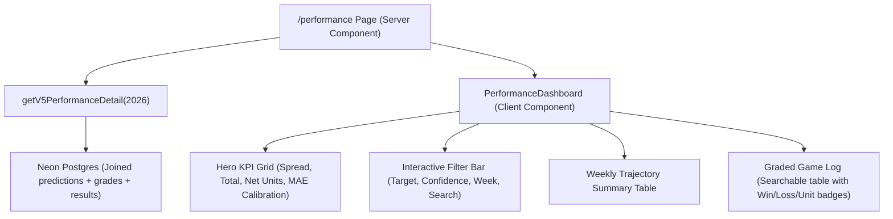

# Implementation Contract: Performance Dashboard Enhancements

- **Status:** Implemented
- **Created:** 2026-10-01
- **Planner:** Sol
- **Approval source:** User explicit approval in chat ("Yes" on 2026-10-01)
- **Implementation log:** `session_logs/2026-10-01/02-performance-dashboard-implementation.md`
- **Commit policy:** Commit with implementation

---

## 1. Goal & Observable Success Criteria

Upgrade `/performance` from a minimal two-card record (`Spread: 93–103–3, Total: 82–77–0`) into an interactive, transparent betting and model analytics dashboard.

### Observable Success Criteria:
1. **Betting Profitability & ROI**: Display net profit in units won/lost and ROI % alongside win/loss records, aggregating `profit_units` from `prediction_grades`.
2. **Model Accuracy & Calibration**: Display empirical Margin MAE, Total MAE, and 95% interval coverage (already calculated in `getV5Performance` but currently hidden).
3. **Interactive Slicing & Filtering**:
   - Filter by **Target**: `All | Spread | Total`
   - Filter by **Confidence**: `All Leans | High Confidence Only (★)`
   - Filter by **Week**: `All Season | Week 0 | Week 1 | Week 2 | Week 3 | Week 4`
   - Filter by **Team Search**: Instant text search filter by team name.
4. **Graded Game Audit Log Table**: Complete table of all graded games showing:
   - Week, kickoff date, matchup with team names and scores
   - Market line, model forecast, and calculated edge
   - Model bet recommendation
   - Graded outcome badge (Win in emerald, Loss in rose, Push in slate)
   - Profit units (+0.91u, -1.00u, 0.00u)
5. **Truthful Provenance Disclosures**: Retain clear disclosure notes that Weeks 0–4 represent retrospective replay with certified V5 ratings, while Week 5+ represents prospective live operations.
6. **Backward Compatibility & Test Mode**: Full compatibility with `CFB_UI_TEST_MODE="1"`, passing all web publication and unit tests.

---

## 2. Current State & Constraints

- **Database State**: Neon Postgres contains `games`, `predictions`, `prediction_runs`, `prediction_grades`, `game_results`, and `site_week_selections`.
- **Existing Performance Function**: `getV5Performance` in `web/src/lib/v5.ts` selects joined rows for `evidenceClass in ('replay', 'live')` and computes `marginMae`, `totalMae`, and 95% coverage, but does not extract `profit_units`, `week`, or individual game details.
- **Web App Architecture**: Next.js 16 (App Router), React 19, Tailwind CSS v4, Drizzle ORM.
- **No Schema Changes**: All required data exists in Postgres; no migrations or pipeline modifications are needed.

---

## 3. Proposed Approach

Build a comprehensive `getV5PerformanceDetail(season: number)` server data loader in `web/src/lib/v5.ts` (or `web/src/lib/performance.ts`), paired with an interactive client dashboard `web/src/components/PerformanceDashboard.tsx`.

### Architecture



---

## 4. Scope

### Included
- Extending server queries in `web/src/lib/v5.ts` to fetch profit units, week numbers, and game details.
- Unit and ROI aggregation logic.
- Building `PerformanceDashboard.tsx` with filter controls, KPI cards, weekly summary, and graded game log.
- Updating `web/src/app/performance/page.tsx` to render the dashboard.
- Providing mock fixture data in `web/src/test/fixtures/publication.ts`.
- Adding unit tests in `web/src/lib/performance.test.ts`.

### Excluded
- Database schema changes (no migrations).
- ML pipeline or rating algorithm changes.
- Matchup Deep Dive page (deferred to Phase 2 contract).

---

## 5. Affected Components and Files

- `web/src/lib/v5.ts`: Add `getV5PerformanceDetail` and export detailed types (`PerformanceSummary`, `GradedGamePick`).
- `web/src/components/PerformanceDashboard.tsx`: New interactive client component.
- `web/src/app/performance/page.tsx`: Server component updated to call `getV5PerformanceDetail`.
- `web/src/test/fixtures/publication.ts`: Extend fixture data with graded game items.
- `web/src/lib/performance.test.ts`: New unit tests for performance aggregations and filtering.

---

## 6. Implementation Tasks

### Task 1 — Data Layer & Aggregations (`web/src/lib/v5.ts`)
**Files:**
- `web/src/lib/v5.ts`
- `web/src/test/fixtures/publication.ts`

**Changes:**
1. Define interfaces:
   ```ts
   export interface BetRecord {
     win: number;
     loss: number;
     push: number;
     units: number;
     roi: number;
     winRate: number;
   }

   export interface PerformanceSummary {
     classification: "all" | "replay" | "live";
     games: number;
     evaluated: number;
     spread: BetRecord;
     total: BetRecord;
     combined: BetRecord;
     marginMae: number | null;
     totalMae: number | null;
     marginCoverage95: number | null;
     totalCoverage95: number | null;
   }

   export interface GradedGamePick {
     gameId: number;
     week: number;
     startDate: Date;
     homeTeam: string;
     awayTeam: string;
     homePoints: number;
     awayPoints: number;
     marketSpread: number | null;
     predictedSpread: number | null;
     spreadLean: "home" | "away" | null;
     spreadResult: "win" | "loss" | "push" | null;
     spreadUnits: number | null;
     spreadEdge: number | null;
     marketTotal: number | null;
     predictedTotal: number | null;
     totalLean: "over" | "under" | null;
     totalResult: "win" | "loss" | "push" | null;
     totalUnits: number | null;
     totalEdge: number | null;
     highConfidence: boolean;
     evidenceClass: "replay" | "live";
   }

   export interface PerformanceDetail {
     summary: PerformanceSummary;
     byWeek: Record<number, PerformanceSummary>;
     gradedGames: GradedGamePick[];
     weeks: number[];
   }
   ```
2. Implement `getV5PerformanceDetail(season: number)`:
   - Query `site_week_selections` joined to `prediction_runs`, `predictions`, `games`, `game_results`, and `prediction_grades` (spread & total targets).
   - Compute summaries for overall, by-week, and confidence slices.
3. Update `web/src/test/fixtures/publication.ts` with representative mock data for `CFB_UI_TEST_MODE="1"`.

**Acceptance criteria:**
- Correctly parses `profit_units` as float numbers.
- Win rate excludes pushes ($\text{Wins} / (\text{Wins} + \text{Losses})$).
- ROI is computed as $\text{Net Units} / \text{Risked Units} \times 100$.
- Test mode returns full fixture data cleanly.

---

### Task 2 — Interactive Dashboard Component (`web/src/components/PerformanceDashboard.tsx`)
**Files:**
- `web/src/components/PerformanceDashboard.tsx`

**Changes:**
1. Create client component with state for:
   - `targetFilter`: `"all" | "spread" | "total"`
   - `confidenceOnly`: `boolean`
   - `weekFilter`: `"all" | number`
   - `searchQuery`: `string`
2. **Hero KPI Grid**:
   - Card 1: Spread Record (`W–L–P`, Win %, Units, ROI).
   - Card 2: Totals Record (`W–L–P`, Win %, Units, ROI).
   - Card 3: Combined Betting ROI (Total Units, Total Graded Bets, Overall ROI %).
   - Card 4: Forecast Calibration (Spread Margin MAE, Total MAE, 95% Coverage).
3. **Filter Toolbar**:
   - Target selector tabs.
   - High Confidence toggle (`★ High Confidence Only`).
   - Week dropdown / pill list.
   - Text search input for filtering games by team name.
4. **Weekly Breakdown Table**:
   - Summary row for each completed week showing record and profit units.
5. **Graded Game Log Table**:
   - Responsive table listing every matching graded pick.
   - Kickoff date, Week, Teams & Score.
   - Market vs Model comparison with edge note.
   - Recommended pick.
   - Result pill (Win = emerald, Loss = rose, Push = neutral).
   - Profit units badge.

**Acceptance criteria:**
- Modifying any filter immediately recalculates the KPIs and filters the game log.
- Full responsive design (desktop table and clean mobile card stack).
- Theme-aware styles adhering to repository styling tokens.

---

### Task 3 — Update Performance Page Route (`web/src/app/performance/page.tsx`)
**Files:**
- `web/src/app/performance/page.tsx`

**Changes:**
- Fetch `getV5PerformanceDetail(2026)` on the server.
- Pass data to `PerformanceDashboard`.
- Maintain retrospective disclosure notes and unavailable fallback states.

**Acceptance criteria:**
- `/performance` renders cleanly with complete data.
- Handles empty/zero-game and unavailable states gracefully.

---

### Task 4 — Validation & Tests
**Files:**
- `web/src/lib/performance.test.ts`

**Changes:**
- Add tests verifying:
  - Aggregation logic: wins, losses, pushes, units, ROI calculation.
  - Correct exclusion of pushes from win rate denominator.
  - Invariant: total graded bets equals wins + losses + pushes.
  - UI test mode rendering.

---

## 7. Testing Strategy

1. **Unit Tests**:
   - Run `node --experimental-strip-types --test src/lib/performance.test.ts`.
2. **Typecheck & Linter**:
   - Run `npm run typecheck` in `web/`.
   - Run `npm run lint` in `web/`.
3. **Contract Checks**:
   - Run `make contracts-check` at repository root.
4. **Existing Publication Suite**:
   - Run `npm run test:publication` in `web/` to confirm zero regression on existing pages.

---

## 8. Risks and Edge Cases

- **Pushes**: Pushes must contribute $0.0$ profit units and must not count as losses in win percentage.
- **Ungraded or No-Line Games**: Games where lines were unavailable or not graded must be excluded from graded bet tallies without throwing null reference errors.
- **Empty Filters**: Searching for a nonexistent team displays a clear, friendly "No matching games found" empty state.

---

## 9. Definition of Done

- [x] `getV5PerformanceDetail` implemented and tested with profit units and week metadata.
- [x] `PerformanceDashboard` component built with KPI grid, filters, weekly table, and game audit log.
- [x] `web/src/app/performance/page.tsx` integrated and verified.
- [x] `npm run typecheck` and `npm run test:publication` pass cleanly.
- [x] `make contracts-check` passes.
- [x] Documentation and session log updated.
- [x] Contract marked as `Implemented`.
