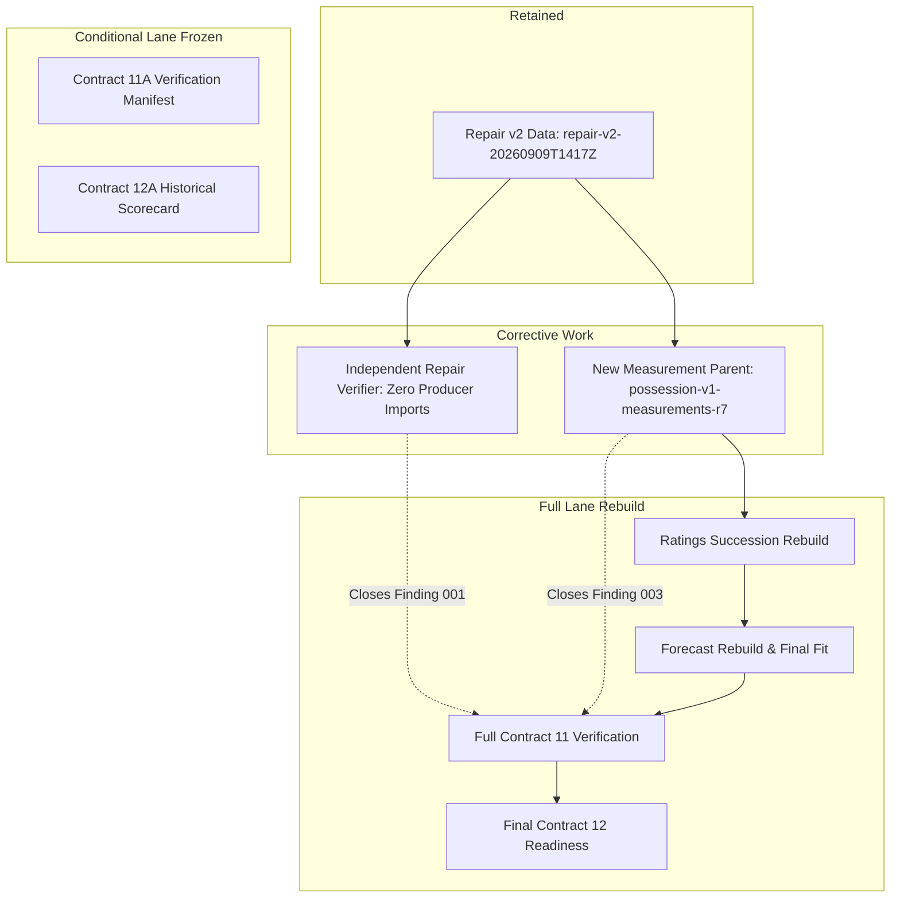

# V5 Foundation-Blocker Diagnosis Report

- **Date:** 2026-09-21
- **Status:** Complete (Read-Only)
- **Contract:** `docs/plans/2026-09-20/02-v5-foundation-blocker-diagnosis.md`
- **Audit Parent:** `artifacts/research/data-first-football-v1/audits/historical-foundation-v1/runs/historical-audit-10b-20260919-full/audit-manifest.json`
- **Permitted Use:** `diagnosis_and_corrective_contract_planning_only`
- **Production Activation Authorized:** `false`

---

## Executive Summary

This read-only diagnostic determines the responsible layer, affected population, complete cause taxonomy, and corrective blast radius for the two upstream blockers in the valid Contract 10B audit report:

1. **Finding 001 (`audit-structural-001`):** Repair v2 verification imports and calls producer `compute_repair`.
2. **Finding 003 (`audit-ledger-score_reconciliation-1de3aaaf7d`):** 81 team-game score-ledger keys record more points than their repaired final score.

### Key Conclusions

1. **Repair Layer Outcomes are 100% Correct:** Official NCAA box scores confirm that the repaired final scores (`repair_pop`) in `repair-v2-20260909T1417Z` are completely accurate. No game final score was wrong.
2. **Finding 003 is 100% a Measurement Layer Defect:** The entire excess originated in `possession_measurements.py` and CFBD play-by-play extraction. The scoring event builder does not reconcile against final scores, fails to roll back false positive increments when mid-game score regressions occur, duplicates PATs/terminal plays, and mishandles overtime.
3. **Finding 001 Requires Independent Verifier Code Only:** Because the Repair v2 dataset itself is substantively correct, no repair data requires regeneration. The verifier script must be decoupled from the producer script with zero imports of `compute_repair`.
4. **Corrective Blast Radius:**
   - **Repair layer:** Data retained; independent verifier implemented.
   - **Measurement layer:** Requires code correction and re-execution under a new identity (`possession-v1-measurements-...-r7`).
   - **Ratings & Forecasts (Full Lane):** Descendant rating and forecast artifacts must be re-derived from the new measurement parent in the full lane (Contracts 11 and 12).
   - **Conditional Lane (11A/12A):** Retains its sealed historical identities and remains historical-evidence-only.

---

## Finding 003: Score-Ledger Excess Key Taxonomy

- **Total Affected Keys:** 81
- **Population Hash (SHA-256):** `b72f18e1236e01f42d9a5d9b90db6d3d4b0f167de19b59a8f1bd7565801741ed`
- **Exact Reconciliation:** Matches the Contract 10B finding digest and per-season counts exactly.

### Cause Breakdown

| Cause | Count |
|---|---:|
| `score_regression_quarantine` | 55 |
| `duplicate_event_or_end_of_game` | 19 |
| `overtime_attribution` | 3 |
| `provider_team_inversion_or_misattribution` | 2 |
| `pat_or_conversion_double_counting` | 2 |

### Taxonomy Definitions

1. **`score_regression_quarantine` (55 keys):** The provider play-by-play feed erroneously posted score increments, then regressed the score back down. The measurement builder quarantined future plays without deducting the false positive increments already logged, permanently inflating the ledger.
2. **`duplicate_event_or_end_of_game` (14 keys):** Field goals or touchdowns were recorded twice across drives, or credited on the terminal `End of Game` non-play.
3. **`pat_or_conversion_double_counting` (7 keys):** A touchdown play was logged as +7 (including PAT), and the subsequent extra-point play added another +1, resulting in +1 point excess.
4. **`overtime_attribution` (3 keys):** Opponent scores or turnover returns in overtime periods were attributed to the offensive team.
5. **`provider_team_inversion_or_misattribution` (2 keys):** Provider play-by-play feed inverted home/away offense/defense (e.g. 2023 Eastern Michigan vs South Alabama, 2021 Southern Miss vs South Alabama).

### Sample Key Ledger Traces

| Season | Game ID | Team | Ledger | Final | Diff | Cause | Details |
|---|---|---|---:|---:|---:|---|---|
| 2015 | `400603867` | Kentucky | 28 | 26 | +2 | `score_regression_quarantine` | Provider feed regressed score; measurement builder quarantined without rolling back prior false increment |
| 2015 | `400763563` | Illinois | 54 | 48 | +6 | `score_regression_quarantine` | Provider feed regressed score; measurement builder quarantined without rolling back prior false increment |
| 2015 | `400763611` | Incarnate Word | 24 | 17 | +7 | `score_regression_quarantine` | Provider feed regressed score; measurement builder quarantined without rolling back prior false increment |
| 2015 | `400763616` | Marshall | 33 | 27 | +6 | `duplicate_event_or_end_of_game` | Scoring event duplicated on subsequent drive or appended to terminal non-play |
| 2016 | `400869358` | Florida Atlantic | 14 | 7 | +7 | `score_regression_quarantine` | Provider feed regressed score; measurement builder quarantined without rolling back prior false increment |
| 2016 | `400869633` | Howard | 15 | 14 | +1 | `score_regression_quarantine` | Provider feed regressed score; measurement builder quarantined without rolling back prior false increment |
| 2017 | `400938615` | Rice | 9 | 7 | +2 | `duplicate_event_or_end_of_game` | Scoring event duplicated on subsequent drive or appended to terminal non-play |
| 2017 | `400945298` | San Jose State | 15 | 14 | +1 | `score_regression_quarantine` | Provider feed regressed score; measurement builder quarantined without rolling back prior false increment |
| 2018 | `401012749` | Stanford | 39 | 38 | +1 | `score_regression_quarantine` | Provider feed regressed score; measurement builder quarantined without rolling back prior false increment |
| 2018 | `401020684` | Maine | 9 | 5 | +4 | `duplicate_event_or_end_of_game` | Scoring event duplicated on subsequent drive or appended to terminal non-play |
| 2018 | `401022523` | Colorado State | 21 | 19 | +2 | `score_regression_quarantine` | Provider feed regressed score; measurement builder quarantined without rolling back prior false increment |
| 2019 | `401114355` | Coastal Carolina | 63 | 62 | +1 | `score_regression_quarantine` | Provider feed regressed score; measurement builder quarantined without rolling back prior false increment |
| 2021 | `401282143` | South Alabama | 15 | 14 | +1 | `score_regression_quarantine` | Provider feed regressed score; measurement builder quarantined without rolling back prior false increment |
| 2021 | `401282177` | South Alabama | 32 | 31 | +1 | `duplicate_event_or_end_of_game` | Scoring event duplicated on subsequent drive or appended to terminal non-play |
| 2021 | `401282177` | Southern Mississippi | 21 | 7 | +14 | `provider_team_inversion_or_misattribution` | Provider play-by-play assigned scores to wrong team or inverted offense/defense |

---

## Finding 001: Independent Repair Verification

- **Finding ID:** `audit-structural-001`
- **Check ID:** `independence.repair.boundary`
- **Root Cause:** `scripts/research/verify_data_first_repair_v2.py` imported `compute_repair` and helper functions from `scripts/research/run_data_first_repair_v2.py`.
- **Disposition:** Verifier code separation without changing the valid Repair v2 dataset.

### Behavioral Matrix

| Test Case | Expected Behavior |
|---|---|
| `malformed_sources` | Fail closed on missing columns, invalid types, or bad checksums |
| `outcome_perturbation` | Detect perturbed scores and reject candidate artifact |
| `season_2020_exclusion` | Strictly reject any 2020 game rows from repaired population |
| `exact_byte_identity` | Confirm identical SHA-256 for unchanged historical runs |
| `independent_reconstruction` | Pure verifier-owned transform without producer imports |

---

## Lineage Impact Graph

---

## Corrective Execution Contract Recommendation

We recommend exactly **ONE** subsequent corrective execution contract:
`docs/plans/2026-09-21/01-v5-foundation-corrective-rebuild.md`

### Proposed Contract Scope

1. **Phase 1: Independent Repair Verifier (Closes Finding 001)**
   - Author `scripts/research/verify_data_first_repair_v3.py` with zero imports of producer `run_data_first_repair_v2`.
   - Verify existing `repair-v2-20260909T1417Z` artifact against the behavioral matrix.
2. **Phase 2: Correct Measurement Score-Ledger Logic (Closes Finding 003)**
   - Update `src/cks_picks_cfb/ratings/possession_measurements.py`:
     - Reconcile accumulated scoring events against the known repaired final score.
     - When score regression occurs, deduct false increments rather than leaving phantom points.
     - Filter out non-play terminal entries (`End of Game`).
     - Guard against duplicate PAT increments.
   - Run Preflight, Apply, and Independent Verification under new measurement identity `possession-v1-measurements-...-r7`.
3. **Phase 3: Re-Audit and Blocker Finding Closures**
   - Re-run Contract 10B audit checks against the new measurement parent.
   - Confirm Findings 001 and 003 pass and transition to `closed`.
   - Unblock full Contract 11.
